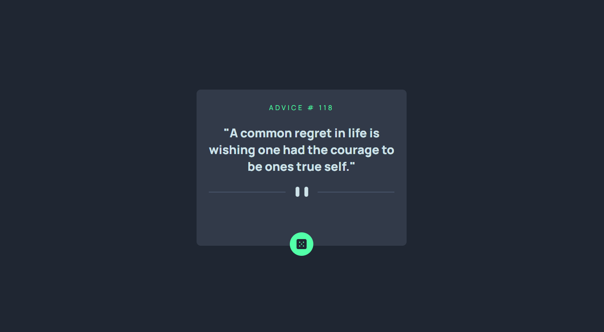

# Overview
- [About Project](#my-first-react-project)
- [Project Idea](#project-idea)
- [Project Screenshot](#project-screenshot)

# My First React Project

This is my first React project, an advice or quote generator that fetches random advice/quotes. I created this project to become comfortable using React and to get a better understanding of it.

## Project Idea

I got the design and project idea from Frontend Mentor. The project is called **[Advice Generator App](https://www.frontendmentor.io/challenges/advice-generator-app-QdUG-13db/hub)**. I chose this project because it's simple, and I get to use an API to fetch advice/quotes. Additionally, I was able to use React's `useState` and `useEffect` hooks and understand how they work.

## Project Screenshot

